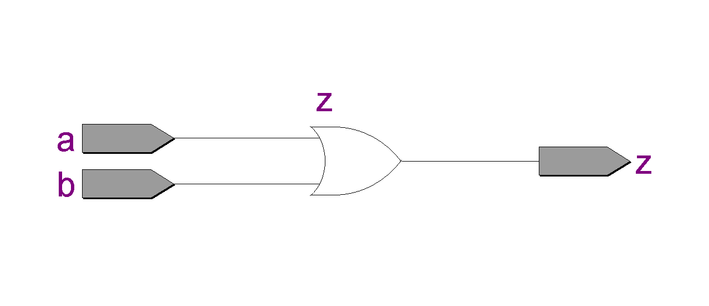

# Questão 1 - Porta OR
----

Desenvolver a porta `AND` utilizando VHDL e simular atraves do software Quartus, da Intel.

### Especificação: Porta OR

| A | B | Z = A + B |
|---|---|---|
|0  |0  |0  |
|1  |0  |1  |
|0  |1  |1  |
|1  |1  |1  |

[visualizar](./assets/tabela_or.csv)


### Descrição do código: VHDL
```vhdl 

library ieee; --biblioteca

--entidade
entity or_gate is 
    port(
        a, b : in bit;
        z    : out bit
    );
end entity or_gate;

--arquitetura
architecture main of or_gate is
    begin
        z <= a or b;    
end architecture main;
```
[visualizar](./or_gate.vhd)

### Ferramentas de Síntese: Quartus II

- ##### RTL Viewer -> Schematics



[download](./assets/RTL_or_gate.pdf) 

### Simulador VHDL: ModelSim

- ##### Wave -> Signals


[visualizar](./waveform_or_gate.vhd)