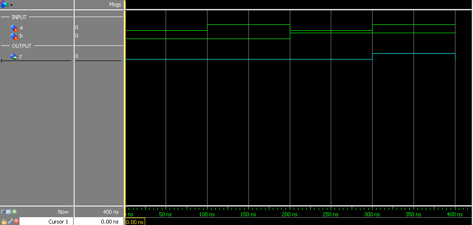

# Questão 2 - Porta AND
----

Fazer o teste da porta `AND` e simular atraves do software Quartus, da Intel.

### Especificação: Porta AND

| A | B | Z = A . B |
|---|---|---|
|0  |0  |0  |
|1  |0  |0  |
|0  |1  |0  |
|1  |1  |1  |

[visualizar](./assets/tabela_and.csv)

### Descrição do código: VHDL
```vhdl 

library ieee; --biblioteca

--entidade
entity and_gate is 
    port(
        a, b : in bit;
        z    : out bit
    );
end entity and_gate;

--arquitetura
architecture main of and_gate is
    begin
        z <= a and b;    
end architecture main;
```
[visualizar](./and_gate.vhd)

### Ferramentas de Síntese: Quartus II

- ##### RTL Viewer -> Schematics


[download](./assets/RTL_and_gate.pdf) 


### Simulador VHDL: ModelSim

- ##### Wave -> Signals


[visualizar](./assets/wave_and_gate.jpg)