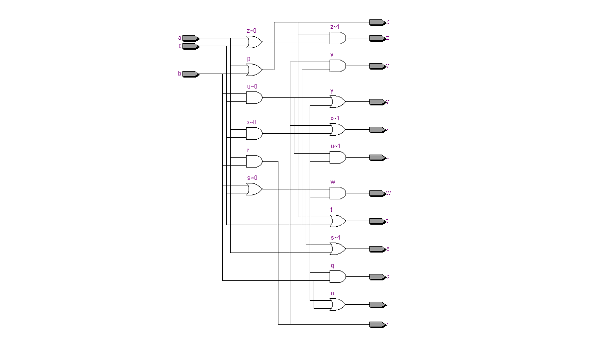
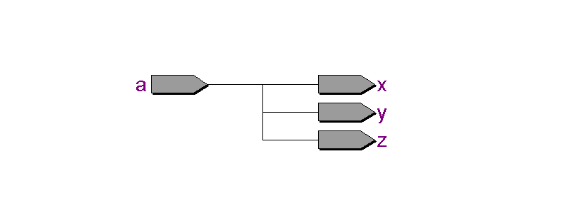
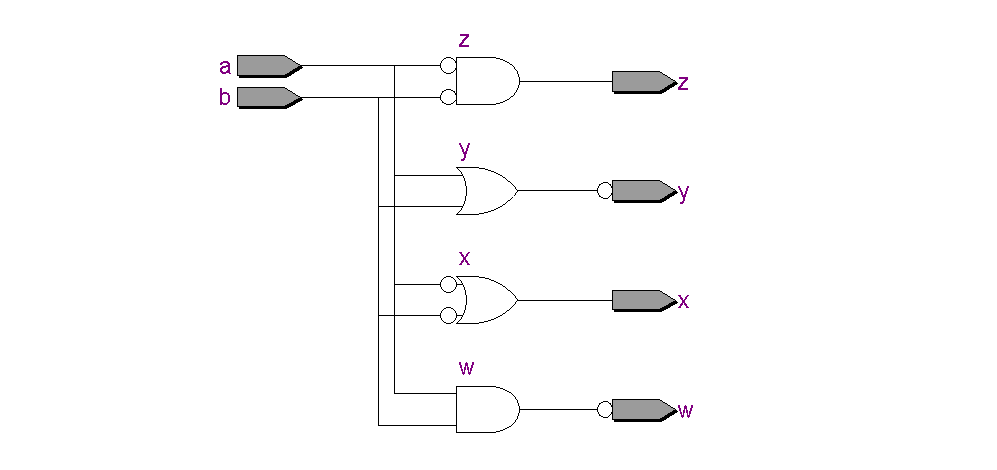

# Questão 3 - Propriedades, postulados e teoremas de De Morgan
---

Desenvolver um código para que seja possível testar todas as `propriedades`,
`postulados` e `teoremas de De Morgan`.

### Propriedades
A lógica booleana tem algumas propriedades que são respeitadas pelas portas `AND`, `OR` e `NOT`, essas propriedades são extremamente úteis na simplificação de circuitos e de expressões. Tal como na matemática comum, valem na Álgebra de Boole, propriedades como: comutativa, associativa e distributiva.

- Comutativa
    > Esta propriedade é válida tanto na adição, como na multiplicação.
    - Adição: `𝐴 + 𝐵 = 𝐵 + 𝐴`;
    - Multiplicação: `𝐴 ⋅ 𝐵 = 𝐵 ⋅ 𝐴`;
- Associativa
    > Esta propriedade é válida tanto na adição, como na multiplicação.
    - Adição: `𝐴 + (𝐵 + 𝐶)=  (𝐴 + 𝐵) + 𝐶`;
    - Multiplicação: `𝐴 ⋅ (𝐵 ⋅ 𝐶) = (𝐴 ⋅ 𝐵) ⋅ 𝐶`;
- Distributiva
    `𝐴 ⋅ (𝐵 + 𝐶) = 𝐴 ⋅ 𝐵 + 𝐴 ⋅ 𝐶`;
    `𝐴 + (𝐵 ⋅ 𝐶) = (𝐴 + 𝐵) ⋅ ( 𝐴 + 𝐶)`;

### Postulados
A seguir serão apresentados os postulados de identidade para as operações de Adição `(Ou)`, Multiplicação `(E)` e Negação `(Não)`.


- Identidade
    1.  `𝐴 + 0 = 𝐴`;
    2. `𝐴 ⋅ 1 = 𝐴`;
    3. `(𝐴')' = 𝐴`;

### Teoremas de De Morgan
Os teoremas de De Morgan são muito empregados na prática, em simplificações de
expressões booleanas e, ainda, no desenvolvimento de circuitos digitais. São duas leis.

- 1ª Lei de De Morgan: `(𝐴 . 𝐵)' = 𝐴' + 𝐵'`;
- 2ª Lei de De Morgan: `(𝐴 + 𝐵)' = 𝐴' . 𝐵'`;

---

- ## Teste 1 - Propriedades
Testar as propriedades da logica booleanas.

### Especificação: Propriedades booleanas

###### Tabela das operações comutativas:
| A | B | A + B | B  + A |A ⋅ B| B ⋅ A|
|---|---|:---:|:---:|:---:|:---:|
|0  |0  |0  |  0  |0|0|
|1  |0  |1  |  1  |0|0|
|0  |1  |1  |  1  |0|0|
|1  |1  |1  |  1  |1|1|

###### Tabela das operações associativas:
| A | B | C | A + (B + C) | (A + B) + C | A ⋅ (B ⋅ C)| (A ⋅ B) ⋅ C|
|---|---|---|:---:|:---:|:---:|:---:|
|0  |0  |0  |0  |  0  |0|0|
|0  |0  |1  |1  |  1  |0|0|
|0  |1  |0  |1  |  1  |0|0|
|0  |1  |1  |1  |  1  |0|0|
|1  |0  |0  |1  |  1  |0|0|
|1  |0  |1  |1  |  1  |0|0|
|1  |1  |0  |1  |  1  |0|0|
|1  |1  |1  |1  |  1  |1|1|

###### Tabela das operações distributivas:
| A | B | C | A ⋅ (B + C) | A ⋅ B + A ⋅ C | A + (B ⋅ C) | (A + B) ⋅ ( A + C)|
|---|---|---|:---:|:---:|:---:|:---:|
|0  |0  |0  |0  |  0  |0|0|
|0  |0  |1  |0  |  0  |0|0|
|0  |1  |0  |0  |  0  |0|0|
|0  |1  |1  |0  |  0  |1|1|
|1  |0  |0  |0  |  0  |1|1|
|1  |0  |1  |1  |  1  |1|1|
|1  |1  |0  |1  |  1  |1|1|
|1  |1  |1  |1  |  1  |1|1|

### Descrição do código: VHDL
```vhdl 

library ieee; --biblioteca

--entidade
entity op_booleanas is
    port (
        a, b, c: in bit;
        o, p, q, r, s, t, u, v, w, x, y, z : out bit
    );
end op_booleanas;

--arquitetura
architecture main of op_booleanas is
    begin
        --(Comutativa)
            --Adicao
        o <= a or b;
        p <= b or a;
            --Multiplicacao
        q <= a and b;
        r <= b and a;
         --(Associativa)
            --Adicao
        s <= a or (b or c);
        t <= (a or b) or c;
            --Multiplicacao
        u <= a and (b and c);
        v <= (a and b) and c;
        --(Distributiva)
            --Adicao
        w <= a and (b or c);
        x <= (a and b) or (a and c);
            --Multiplicacao      
        y <= a or (b and c);
        z <= (a or b) and (a or c);
end architecture main;
```
[visualizar](./op_booleanas.vhd)

### Ferramentas de Síntese: Quartus II

- ##### RTL Viewer -> Schematics



[download](./assets/RTL_View_op_booleanas.pdf) 

### Simulador VHDL: ModelSim

- ##### Wave -> Signals


[visualizar](./waveform_op_booleanas.vhd)

---

- ## Teste 2 - Postulados
Testar as postulados de identidade.

### Especificação: Postulados de identidade
###### Tabela identidade:
| A | 0 | 1 | A + 0 | A ⋅ 1| (A')'|
|---|---|:---:|:---:|:---:|:---:|
|0  |0  |1  |  0  | 0 | 0 |
|1  |0  |1  |  1  | 1 | 1 |

### Descrição do código: VHDL
```vhdl 

library ieee; --biblioteca

--entidade
entity postulados is
    port (
        a: in bit;
        x, y, z : out bit
    );
end postulados;

--arquitetura
architecture main of postulados is
    begin
        x <= a or '0';
        y <= a and '1';
        z <= not(not(a));
end architecture main;
```
[visualizar](./postulados.vhd)

### Ferramentas de Síntese: Quartus II

- ##### RTL Viewer -> Schematics



[download](./assets/RTL_View_postulados.pdf) 

### Simulador VHDL: ModelSim

- ##### Wave -> Signals


[visualizar](./waveform_postulados.vhd)

---

- ## Teste 3 - Teoremas de De Morgan
Testar os teoremas de De Morgan.

### Especificação: De Morgan

###### Tabela de De Morgan:
| A | B | (A . B)' | A' + B' |(A + B)'| A' . B'|
|---|---|:---:|:---:|:---:|:---:|
|0  |0  |1  |  1  |1|1|
|1  |0  |1  |  1  |0|0|
|0  |1  |1  |  1  |0|0|
|1  |1  |0  |  0  |0|0|

### Descrição do código: VHDL
```vhdl 
library ieee; --biblioteca

--entidade
entity de_morgan is
    port (
        a, b: in bit;
        w, x, y, z : out bit
    );
end de_morgan;

--arquitetura
architecture main of de_morgan is
    begin
        --1th lei de De Morgan
        w <= not(a and b);
        x <= not(a) or not(b);
        --2th lei de De Morgan
        y <= not(a or b);
        z <= not(a) and not(b);
end architecture main;
```
[visualizar](./de_morgan.vhd)

### Ferramentas de Síntese: Quartus II

- ##### RTL Viewer -> Schematics



[download](./assets/RTL_View_de_morgan.pdf)

### Simulador VHDL: ModelSim

- ##### Wave -> Signals


[visualizar](./waveform_de_morgan.vhd)