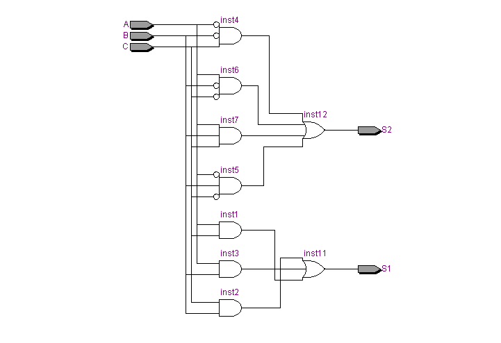
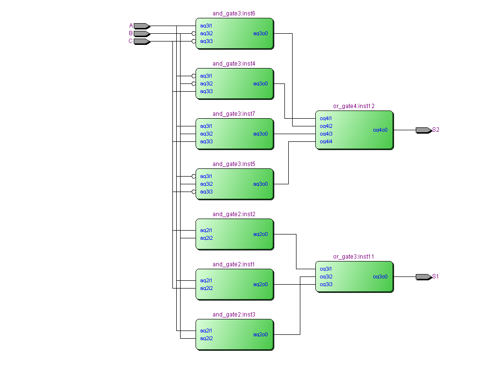

# Circuito Contador de 1´s
----
A construção de um circuito contador de 1's envolve várias etapas sequenciais, incluindo a análise da tabela verdade do circuito. A tabela verdade explicita as entradas, saídas e todas as possibilidades lógicas do circuito.

### Especificação: Circuito contador de 1´s

- **Características do circuito:**
    O circuito lógico em análise possuí $N$ entradas, $M$ saídas e $C$ combinações possíveis, assim:
    - N° entradas $\longrightarrow N = 3$
    - N° saídas $\longrightarrow M =2$
    - N° de combinações possíveis ${\longrightarrow C= 2}^{N} = {2}^3 = 8$
    &nbsp;


- **Tabela verdade do circuito:**

|Entrada 1| Entrada 2 | Entrada 3 | Saida 1| Saida 2|
|:---:|:---:|:---:|:---:|:---:|
| $A$ | $B$ | $C$ | $S_1$|  $S_2$ |
|0  |0  |0  | 0| 0 |
|0  |0  |1  |0| 1 |
|0  |1  |0  |0| 1 |
|0 |1  |1 |1| 0 |
|1 | 0 | 0 | 0|  1 |
|1 |0  |1  |1 |0 |
|1  |1  |0  |1| 0 |
|1  |1  |1  |1| 1 |

[visualizar](./assets/tabela_verdade_circuito_contador.csv)
&nbsp;

- **Equação Booleana do circuito**
    Através da utilização da técnica de soma de minitermos, é possível obter:
    &nbsp;
    ${S_1(A,B,C) = 𝐴'⋅𝐵⋅𝐶 + 𝐴⋅𝐵'⋅𝐶 + 𝐴⋅𝐵⋅𝐶' + 𝐴⋅𝐵⋅𝐶}$
    ${\newline}$
    ${𝑆_2(A,B,C) = 𝐴'⋅𝐵'⋅𝐶+𝐴'⋅𝐵⋅𝐶' + 𝐴⋅𝐵'·𝐶'+ 𝐴⋅𝐵⋅𝐶}$
    ${\newline}$

    - **Simplificação da equação Booleana do circuito**
        Por meio da aplicação de teoremas, postulados e propriedades, é possível obter:
        &nbsp;
        $\rightarrow {S_1(A,B,C) = 𝐴⋅𝐵 + 𝐴⋅𝐶 + 𝐵⋅𝐶}//$ [dedução 1](.pdf)

        &nbsp;
        $\rightarrow {𝑆_2(A,B,C) = 𝐴'⋅𝐵'⋅𝐶+𝐴'⋅𝐵⋅𝐶' + 𝐴⋅𝐵'·𝐶'+ 𝐴⋅𝐵⋅𝐶}$
        &nbsp;

### Ferramentas de Síntese: Quartus II

Representando o circuito na forma de portas lógicas

- ##### RTL Viewer -> Schematics



[download](./assets/RTL_viewer.pdf) 

### Simulador Quartus: Waveform

- ##### Wave -> Signals


[visualizar](./RTL_waveform_simulation.png)

### Descrição do código: VHDL
Descrevendo o circuito em VHDL e simulando utilizando o Quartus/Modelsim.

```vhdl 

--bibliotecas
library ieee; 
use ieee.std_logic_1164.all;

--entidade
entity circuito_contador_1s is
    port(
        A,B,C : in bit;
        S1,S2 : out bit
    );
end entity circuito_contador_1s;

--arquitetura
architecture RTL of circuito_contador_1s is

    --Declaração das componentes(quase como classes em c++)
    component and_gate2 is
        port (
            ag2i1, ag2i2 : in bit;
            ag2o0  : out bit
        ); 
    end component;

    component and_gate3 is
        port(
            ag3i1, ag3i2, ag3i3: in bit;
            ag3o0 : out bit
        );
    end component;

    component or_gate3 is
        port(
            og3i1, og3i2, og3i3 : in bit;
            og3o0 : out bit
        );
    end component;

    component or_gate4 is
        port(
            og4i1, og4i2, og4i3, og4i4 : in bit;
            og4o0 : out bit
        );
    end component;

    --Declaração de sinais (Ligações fora entidades)
    signal in_inst12 : bit_vector(3 downto 0); --vetor que armazena as 4 entradas da porta lógica or_gate4        
    signal in_inst11 : bit_vector(2 downto 0); --vetor que armazena as 3 entradas da porta lógica or_gate3

--inicio da funcionalidade da entidade circuito_contador_1s(o início do código que descreve o comportamento do circuito digital)
begin

    --instâncias and_gate2(macrofunção) ideia: conectar as pontas das instâncias por fios(signals ou entidades)
    inst1 : and_gate2 
        port map(
            ag2i1 => A,
            ag2i2 => C,
            ag2o0 => in_inst11(2)
        );
    
    inst2 : and_gate2 
        port map(
            ag2i1 => C,
            ag2i2 => B,
            ag2o0 => in_inst11(0)
    );

    inst3 : and_gate2 
        port map(
            ag2i1 => A,
            ag2i2 => B,
            ag2o0 => in_inst11(1)
    );

    --instâncias and_gate3
    inst4 : and_gate3 
        port map(
            ag3i1 => not(A),
            ag3i2 => not(B),
            ag3i3 => C,
            ag3o0 => in_inst12(0)
    );

    inst5 : and_gate3 
        port map(
            ag3i1 => not(A),
            ag3i2 => B,
            ag3i3 => not(C),
            ag3o0 => in_inst12(3)
    );

    inst6 : and_gate3 
        port map(
            ag3i1 => A,
            ag3i2 => not(B),
            ag3i3 => not(C),
            ag3o0 => in_inst12(1)
    );

    inst7 : and_gate3 
        port map(
            ag3i1 => A,
            ag3i2 => B,
            ag3i3 => C,
            ag3o0 => in_inst12(2)
    );
	 
    --ultimas conexões
    inst11 : or_gate3
        port map(
            og3i1 => in_inst11(0),
            og3i2 => in_inst11(1),
            og3i3 => in_inst11(2),
            og3o0 => S1
	 );
	  inst12 : or_gate4
        port map(
            og4i1 => in_inst12(0),
            og4i2 => in_inst12(1),
            og4i3 => in_inst12(2),
			og4i4 => in_inst12(3),
            og4o0 => S2
    );
end architecture RTL;
```
[visualizar](./circuito_contador_1s.vhd)

### Ferramentas de Síntese: Quartus II

- ##### RTL Viewer -> Schematics



[download](./assets/RTL_viewer_components.pdf) 

### Simulador VHDL: ModelSim

- ##### Wave -> Signals


[visualizar](./RTL_waveform_simulation_with_components.png)