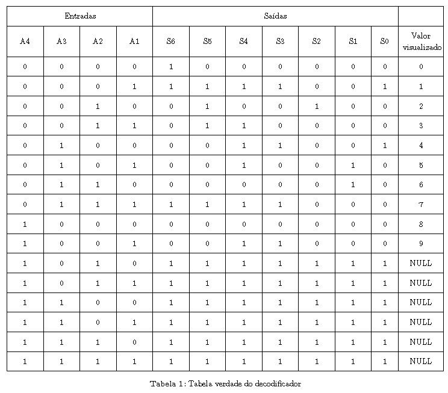
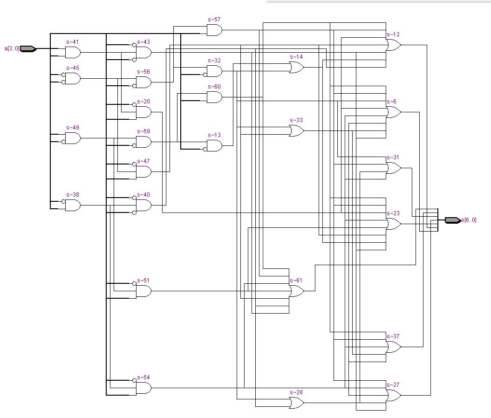
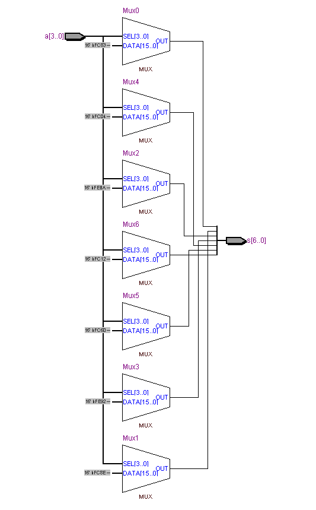

### Etapa 2 - Display de 7 segmentos

---

#### Especificação: Decodificador BCD 4X7

<style>
    img{
        max-width: 100%;
        height: auto;
    }
</style>



- #### Descrição por portas lógicas

``` vhdl
--bibliotecas
library ieee; 
use ieee.std_logic_1164.all;

--entidade
entity dcd_bcd is
    port(
        a : in bit_Vector(3 downto 0);
        s : out bit_Vector(6 downto 0)
    );
end entity dcd_bcd;

--arquitetura
architecture RTL of dcd_bcd is

    --inicio do comportamento
    begin
        s(0) <= (not(a(0)) and not(a(1)) and not(a(2)) and not(a(3)))
                or (not(a(0)) and not(a(1)) and a(2) and not(a(3)))
                or (a(0) and a(1) and not(a(2)) and not(a(3)))
                or (a(0) and not(a(1)) and a(2) and not(a(3)))
                or (not(a(0)) and a(1) and a(2) and not(a(3)))
                or (a(0) and a(1) and a(2) and not(a(3)))
                or (not(a(0)) and not(a(1)) and not(a(2)) and not(a(3)))
                or ((not(a(0)) and not(a(1)) and not(a(2)) and a(3)))
                or (a(0) and not(a(1)) and not(a(2)) and a(3));

        s(1) <= (not(a(0)) and not(a(1)) and not(a(2)) and not(a(3)))
                or (a(0) and not(a(1)) and not(a(2)) and not(a(3)))
                or (not(a(0)) and a(1) and not(a(2)) and not(a(3)))
                or (a(0) and a(1) and not(a(2)) and not(a(3)))
                or (not(a(0)) and not(a(1)) and a(2) and not(a(3)))
                or (a(0) and a(1) and a(2) and not(a(3)))
                or (not(a(0)) and not(a(1)) and not(a(2)) and a(3))
                or (a(0) and not(a(1)) and not(a(2)) and a(3));
        
        s(2) <= (not(a(0)) and not(a(1)) and not(a(2)) and not(a(3)))
                or (a(0) and not(a(1)) and not(a(2)) and not(a(3)))
                or (a(0) and a(1) and not(a(2)) and not(a(3)))
                or (not(a(0)) and not(a(1)) and a(2) and not(a(3)))
                or (a(0) and not(a(1)) and a(2) and not(a(3)))
                or (not(a(0)) and a(1) and a(2) and not(a(3)))
                or (a(0) and a(1) and a(2) and not(a(3)))
                or (not(a(0)) and not(a(1)) and not(a(2)) and a(3))
                or (a(0) and not(a(1)) and not(a(2)) and a(3));
        
        s(3) <= (not(a(0)) and not(a(1)) and not(a(2)) and not(a(3)))
                or (not(a(0)) and a(1) and not(a(2)) and not(a(3)))
                or (a(0) and a(1) and not(a(2)) and not(a(3)))
                or (a(0) and not(a(1)) and a(2) and not(a(3)))
                or (not(a(0)) and a(1) and a(2) and not(a(3)))
                or (not(a(0)) and not(a(1)) and not(a(2)) and a(3));
        
        s(4) <= (not(a(0)) and not(a(1)) and not(a(2)) and not(a(3)))
                or (not(a(0)) and a(1) and not(a(2)) and not(a(3)))
                or (not(a(0)) and a(1) and a(2) and not(a(3)))
                or (not(a(0)) and not(a(1)) and not(a(2)) and a(3))
                or (not(a(0)) and not(a(1)) and not(a(2)) and not(a(3)));
        
        s(5) <= (not(a(0)) and not(a(1)) and not(a(2)) and not(a(3)))
                or (not(a(0)) and not(a(1)) and a(2) and not(a(3)))
                or (a(0) and not(a(1)) and a(2) and not(a(3)))
                or (not(a(0)) and a(1) and a(2) and not(a(3)))
                or (not(a(0)) and not(a(1)) and not(a(2)) and a(3))
                or (a(0) and not(a(1)) and not(a(2)) and a(3));

        s(6) <= (not(a(0)) and a(1) and not(a(2)) and not(a(3)))
                or (a(0) and a(1) and not(a(2)) and not(a(3)))
                or (not(a(0)) and not(a(1)) and a(2) and not(a(3)))
                or (a(0) and not(a(1)) and a(2) and not(a(3)))
                or (not(a(0)) and a(1) and a(2) and not(a(3)))
                or (not(a(0)) and not(a(1)) and not(a(2)) and a(3))
                or (a(0) and not(a(1)) and not(a(2)) and a(3));

end architecture RTL;

```
- #### RTL Viewer



---

- #### Descrição comportamental

``` vhdl

--bibliotecas
library ieee; 
use ieee.std_logic_1164.all;

--entidade
entity dcd_bcd is
    port(
        a : in bit_Vector(3 downto 0);
        s : out bit_Vector(6 downto 0)
    );
end entity dcd_bcd;

--arquitetura
architecture RTL of dcd_bcd is

--inicio do comportamento
begin

    process(a)
    begin
        case a is
            when "0000" =>
                s <= "1000000"; -- 0
            when "0001" =>
                s <= "1111001"; -- 1
            when "0010" =>
                s <= "0100100"; -- 2
            when "0011" =>
                s <= "0110000"; -- 3
            when "0100" =>
                s <= "0011001"; -- 4
            when "0101" =>
                s <= "0010010"; -- 5
            when "0110" =>
                s <= "0000010"; -- 6
            when "0111" =>
                s <= "1111000"; -- 7
            when "1000" =>
                s <= "0000000"; -- 8
            when "1001" =>
                s <= "0011000"; -- 9
            when others =>
                s <= "1111111"; -- display ligado
        end case;
    end process;
	 
end architecture RTL;

```

- #### RTL Viewer



---